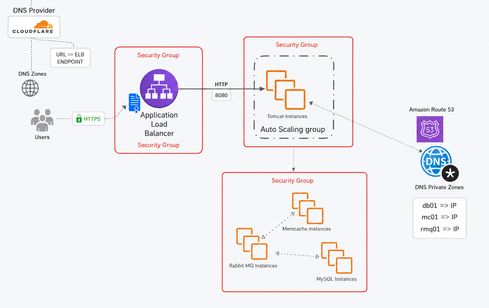
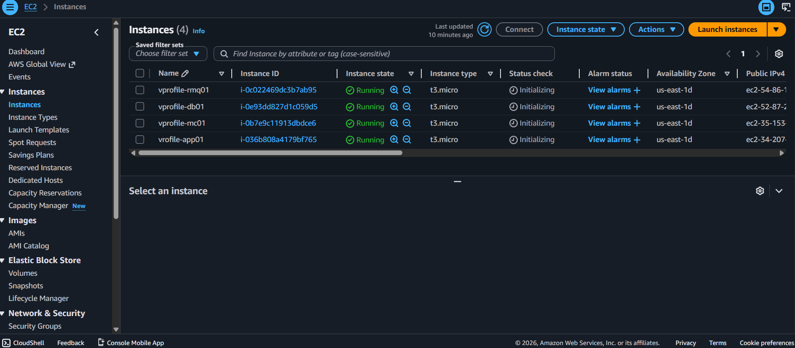

# 🚀 AWS Lift & Shift Migration Project (VProfile Application)

## 📌 Project Overview

This project demonstrates a complete AWS Lift & Shift migration of the VProfile multi-tier Java web application into the AWS Cloud using production-style architecture and deployment practices.

The project was designed to simulate a real-world cloud migration environment while improving scalability, high availability, reliability, and deployment automation using AWS services and Linux administration skills.

---

# 🏗️ Architecture Diagram



---

# ☁️ AWS Services Used

- Amazon EC2
- Application Load Balancer (ALB)
- Auto Scaling Group (ASG)
- Amazon Route 53
- AWS Certificate Manager (ACM)
- Amazon S3
- IAM Roles
- Security Groups
- CloudWatch

---

# ⚙️ Technologies Used

- Java
- Apache Tomcat
- MySQL
- RabbitMQ
- Memcached
- Maven
- Linux
- Bash Scripting

---

# 🔹 Project Highlights

✅ Deployed multi-tier application infrastructure on AWS EC2  
✅ Configured Apache Tomcat, MySQL, RabbitMQ, and Memcached services  
✅ Built and packaged Java application artifacts using Maven  
✅ Uploaded application artifacts to Amazon S3  
✅ Configured Application Load Balancer (ALB) with HTTPS  
✅ Implemented Auto Scaling Groups for scalability and high availability  
✅ Used Route 53 Private Hosted Zones for internal service discovery  
✅ Configured Security Groups for controlled communication  
✅ Automated server configuration using Bash scripting and EC2 User Data  
✅ Worked with IAM roles, Linux administration, DNS mapping, and troubleshooting  
✅ Performed deployment validation, monitoring, and health checks  

---

# 🧱 Architecture Overview

The application follows a multi-tier architecture design:

```text
Users
   ↓
Route 53 DNS
   ↓
Application Load Balancer (HTTPS)
   ↓
Tomcat EC2 Instances (Auto Scaling Group)
   ↓
Backend Services
 ├── MySQL
 ├── RabbitMQ
 └── Memcached
```

---

# ⚙️ Deployment Explanation

## 1️⃣ Infrastructure Provisioning

Created AWS infrastructure components including:
- VPC
- Public and Private Subnets
- Internet Gateway
- Route Tables
- Security Groups

Configured secure communication between all application components.

---

## 2️⃣ Backend Service Configuration

Launched EC2 instances for:
- MySQL
- RabbitMQ
- Memcached

Installed and configured all required backend services using Linux administration and Bash scripting.

Verified connectivity between all backend components.

---

## 3️⃣ Application Build Process

Built the VProfile Java application using Maven.

### Build Command

```bash
mvn install
```

Generated deployable WAR artifact:

```text
target/vprofile-v2.war
```

---

## 4️⃣ Artifact Upload to Amazon S3

Uploaded the generated application artifact to Amazon S3 for centralized deployment and storage.

---

## 5️⃣ Apache Tomcat Deployment

Configured Apache Tomcat servers on EC2 instances.

Tasks performed:
- Installed Java and Tomcat
- Configured application deployment
- Configured database connectivity
- Deployed WAR artifact
- Started and validated Tomcat services

---

## 6️⃣ Load Balancing & HTTPS Configuration

Configured an Application Load Balancer (ALB) to distribute incoming traffic across application servers.

Implemented HTTPS using AWS Certificate Manager (ACM).

Configured:
- HTTPS Listener
- Target Groups
- Health Checks

---

## 7️⃣ Auto Scaling Configuration

Implemented Auto Scaling Groups to improve:
- High Availability
- Fault Tolerance
- Scalability

Configured Launch Templates and scaling policies.

---

## 8️⃣ DNS & Service Discovery

Configured Route 53:
- Public DNS Records
- Private Hosted Zones

Used internal DNS mapping for backend communication.

---

## 9️⃣ Security Configuration

Configured Security Groups to control communication between:
- Load Balancer
- Application Servers
- Database Servers
- RabbitMQ
- Memcached

Implemented secure access policies using least-privilege principles.

---

## 🔟 Deployment Validation & Troubleshooting

Performed:
- Health Checks
- Service Validation
- Application Testing
- Connectivity Troubleshooting

Validated successful deployment through browser access and backend service communication.

---

# 📸 Project Screenshots

## Architecture Diagram


---

## EC2 Instances


---

## Auto Scaling Group


---

## Route 53 Configuration


---

## S3 Artifact Upload


---

## Security Groups


---

## Application Deployment


---

# 🛠️ Example Automation Script

```bash
#!/bin/bash

yum update -y
yum install java -y
yum install tomcat -y

systemctl enable tomcat
systemctl start tomcat
```

---

# 📂 Project Structure

```text
aws-lift-and-shift-vprofile/
│
├── README.md
├── architecture/
│   └── architecture-diagram.png
│
├── screenshots/
│   ├── ec2/
│   ├── autoscaling/
│   ├── route53/
│   ├── s3/
│   ├── security-groups/
│   └── deployment/
│
├── scripts/
│   ├── tomcat.sh
│   ├── mysql.sh
│   ├── rabbitmq.sh
│   └── memcached.sh
│
└── docs/
    └── deployment-guide.md
```

---

# 📈 Skills Demonstrated

- AWS Cloud Infrastructure
- Linux Administration
- Networking & DNS
- Deployment Automation
- DevOps Fundamentals
- Troubleshooting
- Infrastructure Scaling
- Security Best Practices
- High Availability Architecture

---

# 🎯 Key Learning Outcomes

This project strengthened my understanding of:
- AWS Cloud Infrastructure
- Lift & Shift Migration Strategy
- Multi-Tier Application Deployment
- Infrastructure Automation
- High Availability Design
- Service Integration
- Real-world Troubleshooting
- Cloud Engineering Best Practices

---

# 🔮 Future Improvements

- Terraform Infrastructure as Code
- Docker Containerization
- Kubernetes / Amazon EKS
- CI/CD Pipeline Automation
- Amazon RDS Migration
- Monitoring with Prometheus & Grafana

---

# 📢 Connect With Me

LinkedIn: www.linkedin.com/in/nokuthula-zulu-762a4157/  
GitHub: https://github.com/Nok2lapatience

---

# 🏷️ Tags

`AWS` `DevOps` `Cloud Computing` `Linux` `EC2` `Route53` `AutoScaling` `LoadBalancer` `Tomcat` `Java` `Cloud Engineer` `Infrastructure as Code`

